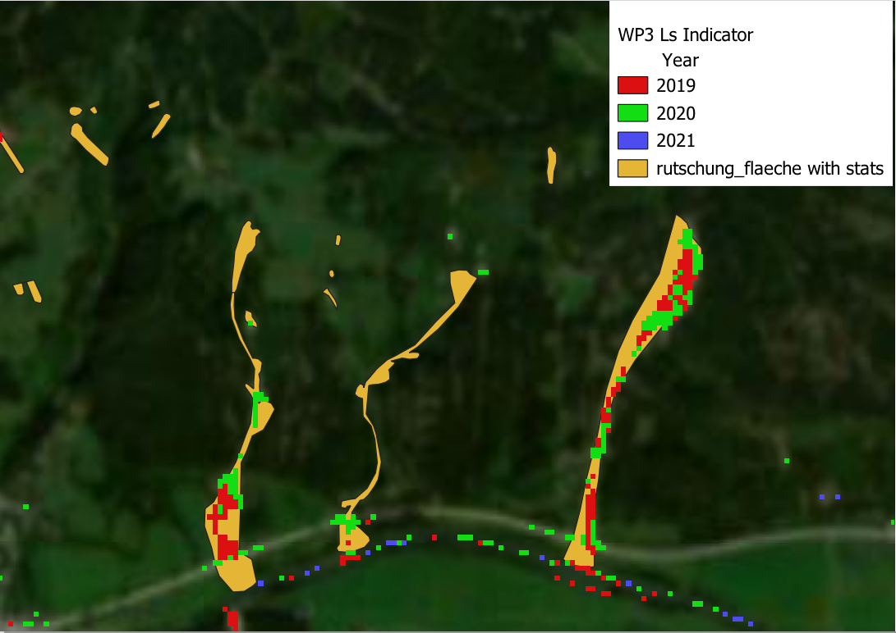

# Inventory Validation Approach

- Based on event polygons of "rutschungsflächen" inventory files:
  `/newstorage2/gaia/wp3/rutschung_flaeche_stats_wgs84.gpkg`

- Now includes rasterstatistics of every polygon of
  
  - WP3 event year (mean, min, majority)
  
  - WP3 NDVI change indicator of event year (mean, min, max)

## S2 Reference Data

- Sentinel Hub EO Browser: [https://apps.sentinel-hub.com/eo-browser](https://apps.sentinel-hub.com/eo-browser)

- General Image Search suggestion:
  
  - Sentinel-2
  
  - Advanced 
    
    - L2A
    
    - Max. cloud coverage: 5-10%
    
    - Time Range 2018-08-01 to 202022-10-01 (to start width)
    
    - Filter by months: Choose a single month e.g. September

## Polygon Search

- EO browser supports input of polygon geometries, but only one at a time

- Easiest method: Use wkt strings provided in rutschungsflächen GPKG
  
  - Copy the string from attribute table, e.g. in QGIS
  
  - 
  
  - In EO-Broser:
    
    - Click on the Green Polygon Button in the uppder right
    
    - Choose Upload a File
    
    - Paste the copied WKT string into the white box, and click Upload
    
    - 

- The window should now zoom onto the entered polygon

## Evaluation

Using suitable search criteria and the entered polygon one should get a list of available scenes. By clicking Visualize, the selected scene can be shown in the window.
Several band combinations are available, most usefull are NDVI and (Optimized-)Natural Color.

Validation:

- Check if you can spot a landslide. Maybe use different color visualizations or deactivate the entered polygon to better see the area beneath the blue highligt colour. 

- Go To Date and Click the calender, you can directly change the year. 

- Load consecutive years, and check for colorchanges/landslides

- Pay special attention to years indicated by `y_min` and `y_majority` columns in attribute table

- In case a Landslide is confirmed, enter the year into the attribute table column `VisibleS2`

## Alternative Method using Google Earth

- Better resolution due to available VHR Imagery

- Less reliable temporally: VHR not are not always available for all years or not at all

Validation:

- Install Google Earth Pro application on your computer

- In QGIS, install `Send2GoogleEarth` Plugin. 

- Load the rutschung_flaeche_stats_wgs84 geopackage as a layer

- Load other base maps if you want, e.g. Google Sattelite via the QuickMapServices Plugin. 

- Click the red Send2GoogleEarth Button to activate the tool and click on a polygon.

- Google earth Pro should open and zoom automatically to the area you clicked on in QGIS

- Check for visible landslides in the area, also utilizing Google Earths Time Slider

- In case a Landslide is confirmed, enter the (aproximate) year into the attribute table column `VisibleGE`
