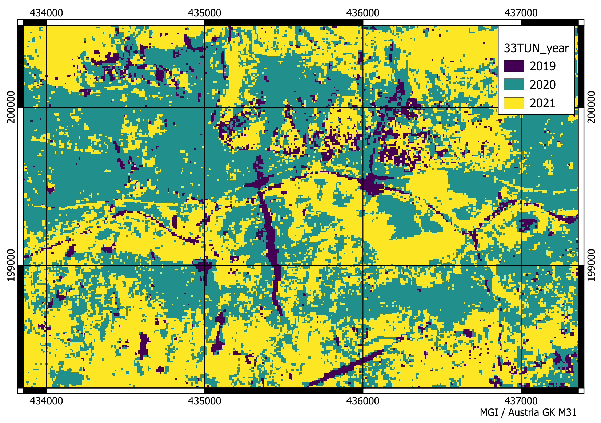

# wp3

## kronos data directory
- newstorage2/gaia/wp3/ WP Root Dir
- ../out_p0_h3/postproc_out WP3 processed outputs
- ../sentinel2_L2A/YYYY/TILE_ID Sentinel-2 L2A raw and derived data dirs organized by year and S2 Tile Id
  - ../NDVI_raw NDVI´s computed from raw S2-L2A data
  - ../NDVI_reconstructed NDVI´s reconstructed for 10 day intervals from model fits
  - ../tmp RAW S2-L2A band data
 
## L2A Raw band data file naming convention
Example:
*33_T_UM_2018_7_S2A_33TUM_20180718_0_L2A_B02.tif*

33_T_UM -> Sentinel-2 TileID. Documentation and download for of the S2 tiling grid see ESA resources e.g. https://sentinels.copernicus.eu/web/sentinel/missions/sentinel-2/data-products  or https://sentinels.copernicus.eu/web/sentinel/user-guides/sentinel-2-msi/product-types
2018_8 -> year_month, here August 2018  
S2A -> Sentinel-2 Sensor ID  
20180817 -> Date in format YYYYMMDD  
0_L2A -> Sentinel-2 processing level. For this project always L2A. The _0_/_1_ prefix not relevant.  
B02 -> Band Number in format B##. Available bands and resolutions on kronos: 2 (10m), 3 (10m), 4 (10m), 8 (10m), 11 (20m) and SCL (20m).  

## Resolution and Size
Typical S2-Tiles have an extent of 109800m * 109800m (10980px * 10980px @ 10m resolution) within their respective UTM projection zone. 

The files are stored as GeoTiff images and already contain information like projection parameters, resolution and other information as metadata. 
For more detailed information about specific tiles, you can access their metadata using QGIS (GUI) or gdalinfo via CLI (https://gdal.org/programs/gdalinfo.html)

## L2A vs L1C
L1C and L2A refer to the processing level of a Sentinel-2 dataset. Level-1C (L1C) is mostly raw data as captured by the sensor (also called Top Of Atmosphere), while L2A data is already corrected for atmospheric effects and includes other products like the Scene-Classification-Layer (SCL). All provided S2 data on kronos is L2A. 

For a more detailed description of S2-L2A please have a look at official technical documentations like https://docs.sentinel-hub.com/api/latest/data/sentinel-2-l2a/

## WP3 Data Outputs

***TILE_ID_NDVI_change_result.tif***  
The main output. Raster of data type Float32 containing the most negative observed NDVI change value observed across the observation period. The corresponding year is stored in ``TILE_ID_year.tif``. This raster is already masked, meaning, values which do not meet certain criteria and threshold values are set to a nodata value in order to reduce noise and artefacts:

- pixels where the largest observed NDVI change is positive. 
- pixels where the compared years for largest observed NDVI change present negative NDVI values, which indicates water surfaces.
- pixels where the largest observed NDVI change is within the 95th-percentile of the raster in order to exlude less significant areas. The cutoff value has been set manually by comparing the results with known landslide events (e.g. the events shown in figure below).

***TILE_ID_year.tif***  
Raster of data type UINT16 containing the year (e.g. 2019) of the highest observed NDVI change, i.e. the year of a possible landslide event. A value is computed for every pixel, regardless of the magnitude of highest observed change across the observation period.

***TILE_ID_p0_stack_2018to2022.tif***  
Raster of data type Float32 containing the mean of the NDVI signal of each year as a separate band, where the first band corresponds to the earliest year of the timeseries (Band 1 - 2018, Band 2 - 2019, ...).

***TILE_ID_year_masked.tif***  
The same as ``TILE_ID_year.tif`` but with the no-data mask of ``TILE_ID_NDVI_change_result.tif`` applied. This was used to compute raster statistics for the event year within the polygons of the inventory data. 

***TILE_ID_min_change.tif***
The main output, without any further filtering or masking. Raster of data type Float32 containing the most negative observed NDVI change value observed across the observation period.

***mosaic_\*.tif***  
Combined raster mosaics of all tiles for the respective output. To assure a common coordinate reference system between the output and the inventory data, the mosaiced raster outputs were reprojected and saved in EPSG:31258 - MGI / Austria GK M31.

